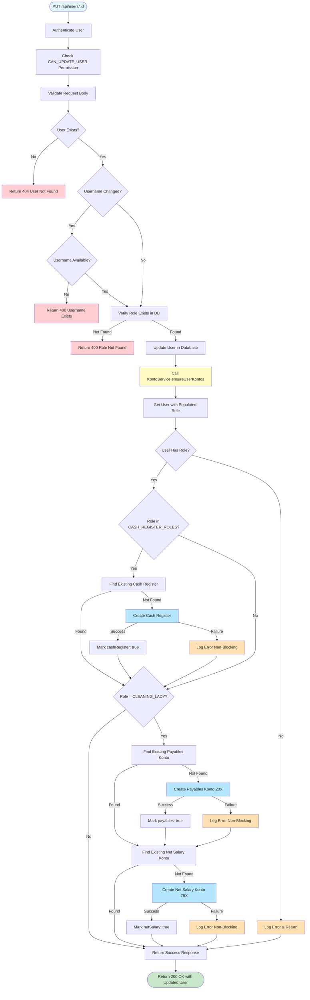

# User Role Update - Automatic Konto Sync (Technical Details)

## Overview

This document describes the technical implementation of automatic konto (account) creation when a user's role is updated via the `PUT /api/users/:id` endpoint.

## Problem Statement

When a user's role changes, they may require additional kontos to function properly in their new role:
- A user promoted to MANAGER needs a Cash Register (10X)
- A user changing to CLEANING_LADY needs Payables (20X) and Net Salary (75X) kontos
- The system must ensure these kontos exist immediately after the role change

## Solution Architecture

The solution uses a **non-blocking, self-healing** approach:
1. User update completes successfully (primary operation)
2. System attempts to create missing kontos (secondary operation)
3. If konto creation fails, it's logged but doesn't fail the user update
4. Missing kontos will be created during the next sync process

## Flow Chart



## Key Implementation Details

### 1. Entry Point: PUT /api/users/:id

**File**: `routes/api/users.js` (lines 231-327)

```javascript
router.put(
  '/:id',
  auth,
  requirePermission('CAN_UPDATE_USER'),
  // ... validation ...
  async (req, res) => {
    // Update user logic...
    const updatedUser = await User.findByIdAndUpdate(/*...*/);

    // Non-blocking konto sync
    let kontosResult = null;
    try {
      kontosResult = await KontoService.ensureUserKontos(updatedUser._id);

      if (kontosResult.errors.length > 0) {
        console.error(`⚠️  Some kontos could not be created for ${updatedUser.fname} ${updatedUser.lname}:`, kontosResult.errors);
      }
    } catch (kontosError) {
      console.error(`⚠️  Error ensuring kontos for ${updatedUser.fname} ${updatedUser.lname}:`, kontosError.message);
    }

    // Always return success for user update
    res.json({
      message: 'User updated successfully',
      user: updatedUser
    });
  }
);
```

### 2. Core Logic: KontoService.ensureUserKontos()

**File**: `services/accounting/KontoService.js` (lines 524-589)

This method checks what kontos the user needs based on their role and creates any missing ones.

**Return Value**:
```javascript
{
  created: {
    cashRegister: boolean,  // true if Cash Register was created
    payables: boolean,       // true if Payables was created
    netSalary: boolean       // true if Net Salary was created
  },
  errors: string[]           // Array of error messages
}
```

**Process**:
1. Load user with populated role
2. Determine what kontos are needed based on role
3. For each needed konto type:
   - Check if it exists using finder helper (`_findCashRegisterForUser`, etc.)
   - If missing, create it using creator helper (`createCashRegisterForUser`, etc.)
   - Track creation in `created` object
4. Return tracking object and errors

### 3. Helper Methods

#### _findCashRegisterForUser(userId, session)
**File**: `services/accounting/KontoService.js` (lines 284-290)

Finds existing Cash Register konto for a user.

```javascript
async _findCashRegisterForUser(userId, session = null) {
  const query = Konto.findOne({
    employeeId: userId,
    isCashRegister: true
  });
  return session ? await query.session(session) : await query;
}
```

#### _findPayablesKontoForUser(userId, session)
**File**: `services/accounting/KontoService.js` (lines 298-305)

Finds existing Payables konto (20X) for a user.

```javascript
async _findPayablesKontoForUser(userId, session = null) {
  const query = Konto.findOne({
    employeeId: userId,
    type: 'liability',
    code: /^20/
  });
  return session ? await query.session(session) : await query;
}
```

#### _findNetSalaryKontoForUser(userId, session)
**File**: `services/accounting/KontoService.js` (lines 313-320)

Finds existing Net Salary konto (75X) for a user.

```javascript
async _findNetSalaryKontoForUser(userId, session = null) {
  const query = Konto.findOne({
    employeeId: userId,
    type: 'expense',
    code: /^75/
  });
  return session ? await query.session(session) : await query;
}
```

#### _safeCreateKonto(createFn, kontoTypeName, userName, counters)
**File**: `services/accounting/KontoService.js` (lines 330-344)

Safely creates a konto with error handling and logging.

```javascript
async _safeCreateKonto(createFn, kontoTypeName, userName, counters) {
  try {
    const created = await createFn();
    console.log(`      ✅ Created ${kontoTypeName} ${created.code} for ${userName}`);
    if (counters.syncedCount !== undefined) {
      counters.syncedCount++;
    }
    return created;
  } catch (error) {
    const errorMsg = `Failed to create ${kontoTypeName} for ${userName}: ${error.message}`;
    console.error(`      ⚠️  ${errorMsg}`);
    counters.errors.push(errorMsg);
    return null;
  }
}
```

#### _ensureKontoExists(options)
**File**: `services/accounting/KontoService.js` (lines 351-383)

Combined check-and-create pattern. This is the workhorse method.

```javascript
async _ensureKontoExists(options) {
  const {
    findFn,           // Function to find existing konto
    createFn,         // Function to create konto if missing
    kontoTypeName,    // Human-readable name for logging
    userName,         // User name for logging
    counters,         // Object to track errors
    trackingObject,   // Object to mark creation (e.g., { cashRegister: false })
    trackingKey       // Key to set to true if created (e.g., 'cashRegister')
  } = options;

  const existingKonto = await findFn();
  if (existingKonto) {
    return existingKonto;
  }

  const created = await this._safeCreateKonto(
    createFn,
    kontoTypeName,
    userName,
    counters || { errors: [] }
  );

  if (created && trackingObject && trackingKey) {
    trackingObject[trackingKey] = true;
  }

  return created;
}
```

## Role-Based Konto Requirements

```javascript
const CASH_REGISTER_ROLES = [
  'OWNER',
  'MANAGER',
  'HOST',
  'CLEANING_LADY',
  'HANDY_MAN'
];
```

| Role | Cash Register (10X) | Payables (20X) | Net Salary (75X) |
|------|---------------------|----------------|------------------|
| OWNER | ✅ | ❌ | ❌ |
| MANAGER | ✅ | ❌ | ❌ |
| HOST | ✅ | ❌ | ❌ |
| CLEANING_LADY | ✅ | ✅ | ✅ |
| HANDY_MAN | ✅ | ❌ | ❌ |

## Example Scenarios

### Scenario 1: HOST → CLEANING_LADY

**Before Update**:
- User: John Doe (HOST)
- Kontos: Cash Register 101 ✅

**After Update**:
- User: John Doe (CLEANING_LADY)
- Kontos:
  - Cash Register 101 ✅ (already exists)
  - Payables to Cleaner - John Doe (201) 🆕
  - Net Salary - John Doe (751) 🆕

**Result**:
```javascript
{
  created: {
    cashRegister: false,  // Already existed
    payables: true,       // Created
    netSalary: true       // Created
  },
  errors: []
}
```

### Scenario 2: Regular User → MANAGER

**Before Update**:
- User: Jane Smith (no cash-handling role)
- Kontos: None

**After Update**:
- User: Jane Smith (MANAGER)
- Kontos:
  - Cash Register 102 🆕

**Result**:
```javascript
{
  created: {
    cashRegister: true,   // Created
    payables: false,      // Not needed for MANAGER
    netSalary: false      // Not needed for MANAGER
  },
  errors: []
}
```

### Scenario 3: MANAGER → OWNER

**Before Update**:
- User: Bob Brown (MANAGER)
- Kontos: Cash Register 103 ✅

**After Update**:
- User: Bob Brown (OWNER)
- Kontos: Cash Register 103 ✅ (no change)

**Result**:
```javascript
{
  created: {
    cashRegister: false,  // Already existed
    payables: false,      // Not needed for OWNER
    netSalary: false      // Not needed for OWNER
  },
  errors: []
}
```

### Scenario 4: Error Handling

**Before Update**:
- User: Alice White (HOST)
- Kontos: Cash Register 104 ✅

**Update to**: CLEANING_LADY

**During Konto Creation**:
- Payables creation fails (database error)
- Net Salary creation succeeds

**Result**:
```javascript
{
  created: {
    cashRegister: false,  // Already existed
    payables: false,      // Failed to create
    netSalary: true       // Created successfully
  },
  errors: [
    'Failed to create Payables konto for Alice White: Connection timeout'
  ]
}
```

**User Update**: Still returns 200 OK ✅
**Missing Konto**: Will be created during next sync process

## Error Handling Strategy

### Non-Blocking Approach

The system uses a **non-blocking, fail-safe** strategy:

1. **User Update is Primary**: User update always completes successfully
2. **Konto Creation is Secondary**: Konto creation failure is logged but doesn't fail the request
3. **Self-Healing**: Missing kontos will be created during the next sync

### Why Non-Blocking?

```javascript
// ❌ BAD: Blocking approach
try {
  await KontoService.ensureUserKontos(userId);
  return res.json({ user: updatedUser });
} catch (error) {
  // User update succeeded but konto creation failed
  // Now we have to rollback user update or return error?
  // User experience is broken!
}

// ✅ GOOD: Non-blocking approach
try {
  const result = await KontoService.ensureUserKontos(userId);
  if (result.errors.length > 0) {
    console.error('Kontos could not be created:', result.errors);
    // Log but don't fail - sync will fix it
  }
} catch (error) {
  console.error('Error ensuring kontos:', error.message);
  // Log but don't fail - sync will fix it
}
// Always return success for user update
return res.json({ user: updatedUser });
```

### Error Logging

All errors are logged with emojis for easy scanning:
- ✅ Success
- ⚠️  Non-blocking error (logged, will be fixed by sync)
- ❌ Fatal error (shouldn't happen in ensureUserKontos)

## Sync Process Backup

If konto creation fails during user update, the **sync process** will fix it:

**File**: `config/db.js` (lines 78-84)

```javascript
// Sync user kontos (backup/healing mechanism)
try {
  await KontoService.syncUserKontos();
} catch (syncError) {
  console.error('❌ Error during user konto sync:', syncError.message);
}
```

This runs every time the application connects to the database (server restart).

## Testing

**File**: `tests/services/KontoService.test.js`

Key test cases for `ensureUserKontos()`:
- ✅ Should create Cash Register when user needs it
- ✅ Should create Payables + Net Salary for CLEANING_LADY
- ✅ Should not create duplicates if kontos already exist
- ✅ Should handle errors gracefully (non-blocking)
- ✅ Should track created kontos correctly

**Total Test Suite**: 33 tests covering all konto creation scenarios

## Performance Considerations

### Database Queries

For each user update with role change:
- 1 query to get user with role
- 1-3 queries to check existing kontos (depending on role)
- 0-3 queries to create missing kontos (depending on role)

**Maximum**: 7 queries (CLEANING_LADY with no kontos)
**Typical**: 2-4 queries (user already has some kontos)

### Response Time Impact

Konto creation adds **minimal latency** to user update:
- Finding kontos: ~5-10ms per query
- Creating kontos: ~10-20ms per creation
- Total added time: ~50-100ms (negligible)

### Optimization

The system is optimized through:
1. **Independent checks**: Each konto type is checked independently
2. **Early returns**: If konto exists, no creation is attempted
3. **No transactions**: Since it's non-blocking, no heavy transaction overhead
4. **Indexed queries**: All konto queries use indexed fields (employeeId, isCashRegister, type, code)

## Code Refactoring (November 2025)

The implementation was recently refactored to eliminate code duplication:

**Before**: ~200 lines with significant duplication
**After**: ~150 lines with reusable helper methods

**Extracted Helpers**:
- `_findCashRegisterForUser()` - DRY for finding cash registers
- `_findPayablesKontoForUser()` - DRY for finding payables
- `_findNetSalaryKontoForUser()` - DRY for finding net salary
- `_safeCreateKonto()` - DRY for safe creation with error handling
- `_ensureKontoExists()` - DRY for check-and-create pattern

This refactoring improved:
- ✅ Maintainability
- ✅ Readability
- ✅ Testability
- ✅ Reduced duplication by ~150 lines

## Security Considerations

### Permission Check

Only users with `CAN_UPDATE_USER` permission can trigger this flow.

### Input Validation

All inputs are validated before database operations:
- User ID must be valid MongoDB ObjectId
- Role must exist in database
- Username must be valid email format

### Error Messages

Error messages are logged server-side only - sensitive information is not exposed to clients.

## Monitoring and Logging

### Success Logs

```
✅ Created Cash Register 105 for John Doe
```

### Warning Logs (Non-Blocking Errors)

```
⚠️  Failed to create Payables konto for Jane Smith: Connection timeout
⚠️  Some kontos could not be created for Jane Smith: [...]
   Missing kontos can be created later via sync process
```

### Fatal Errors (Should Never Happen)

```
❌ Fatal error ensuring kontos for user: User not found
```

## Related Documentation

- [User Account Creation](./user-account-creation.md) - User-friendly overview
- [Apartment Account Creation](./apartment-account-creation.md) - Similar pattern for apartments
- Chart of Accounts - Complete list of konto codes

---

**Document Version**: 1.0
**Date**: 2025-11-11
**Author**: Development Team
**Status**: Active Implementation
**Last Updated**: 2025-11-11 after refactoring
