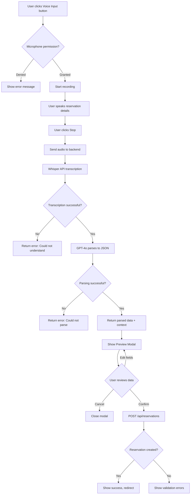
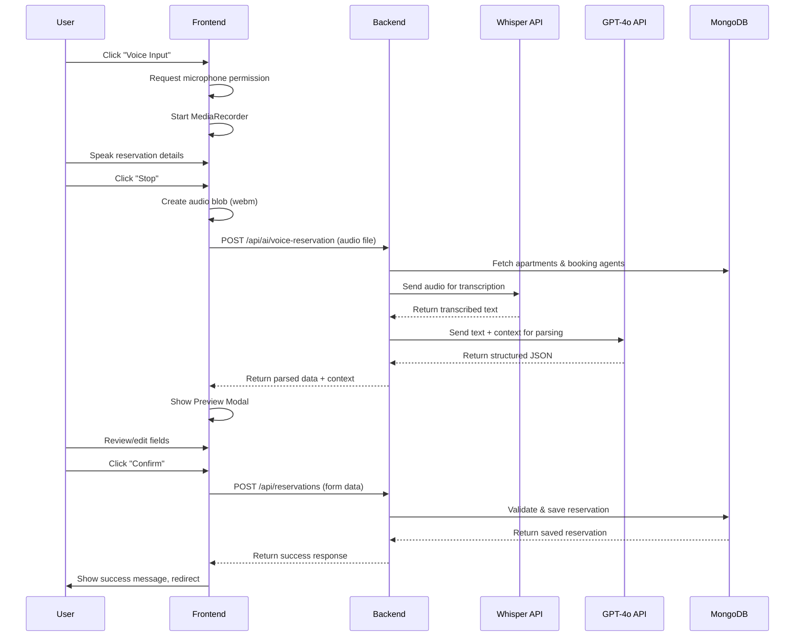

# Voice-to-Reservation Feature

## Overview

This feature enables users with reservation creation permissions (HOST, MANAGER, OWNER roles) to create reservations using voice input. The system uses OpenAI's Whisper API for speech-to-text transcription and GPT-4o for parsing the transcribed text into structured reservation data.

---

## Table of Contents

(Insert Confluence TOC manually via Insert → Table of Contents)

---

## User Flow

1. User navigates to the New Reservation page
2. User clicks the "Voice Input" button
3. Browser requests microphone permission (first time only)
4. User speaks reservation details naturally
5. User clicks "Stop" to end recording
6. System processes the audio and displays parsed data in a preview modal
7. User reviews and edits any fields if needed
8. User confirms to create the reservation

---

## Architecture

### Flowchart



### Sequence Diagram



---

## API Endpoint

### POST /api/ai/voice-reservation

Processes a voice recording and returns parsed reservation data.

**Authentication:** Required (JWT token)

**Permission:** `CAN_CREATE_RESERVATION`

**Request:**

| Parameter | Type | Description |
|-----------|------|-------------|
| audio | File (multipart/form-data) | Audio file (webm, mp3, wav, m4a, ogg) |

**Response (Success):**

```json
{
  "success": true,
  "confidence": "high",
  "data": {
    "plannedCheckIn": "2024-02-20",
    "plannedCheckOut": "2024-02-25",
    "plannedArrivalTime": "14:00",
    "plannedCheckoutTime": "11:00",
    "apartment": "507f1f77bcf86cd799439011",
    "apartmentName": "Apartment Delta",
    "phoneNumber": "+381641234567",
    "bookingAgent": null,
    "bookingAgentName": "Direct",
    "pricePerNight": 50,
    "totalAmount": 250,
    "calculatedNights": 5,
    "reservationNotes": "",
    "guestName": "John Smith"
  },
  "missingFields": [],
  "warnings": [],
  "originalTranscription": "Reservation for apartment delta...",
  "context": {
    "apartments": [...],
    "bookingAgents": [...]
  }
}
```

**Response (Partial Success):**

```json
{
  "success": false,
  "confidence": "low",
  "data": {
    "plannedCheckIn": "2024-02-20",
    "phoneNumber": "+381641234567",
    ...
  },
  "missingFields": ["plannedCheckOut", "apartment", "pricePerNight"],
  "warnings": ["Apartment not recognized in system"],
  "originalTranscription": "..."
}
```

**Error Responses:**

| Status | Description |
|--------|-------------|
| 400 | No audio file provided |
| 400 | Invalid audio format |
| 400 | Audio file too large (max 25MB) |
| 401 | Unauthorized (no token) |
| 403 | Permission denied |
| 422 | Could not transcribe audio |
| 422 | Could not parse reservation |
| 500 | Server error |

---

## Technical Implementation

### Backend Components

| Component | Path | Description |
|-----------|------|-------------|
| VoiceReservationService | `services/ai/VoiceReservationService.js` | Core logic for Whisper + GPT |
| Voice Reservation Route | `routes/api/ai/voice-reservation.js` | API endpoint |
| AI Routes Index | `routes/api/ai/index.js` | Route aggregator |
| Validation Constants | `constants/validation.js` | Shared patterns |

### Frontend Components

| Component | Path | Description |
|-----------|------|-------------|
| VoiceReservationInput | `components/VoiceReservation/VoiceReservationInput.js` | Main wrapper component |
| VoiceRecordButton | `components/VoiceReservation/VoiceRecordButton.js` | Recording button |
| VoiceReservationPreview | `components/VoiceReservation/VoiceReservationPreview.js` | Preview modal |
| useVoiceRecorder | `hooks/useVoiceRecorder.js` | MediaRecorder hook |
| voiceReservation module | `modules/voiceReservation/` | Redux state management |

---

## Voice Input Examples

Users can speak reservation details naturally. The system will parse:

**Example 1 - Full details:**
> "Reservation for apartment Delta from February 20th to February 25th, phone number 064 123 4567, price 50 euros per night, guest name is John Smith"

**Example 2 - With booking agent:**
> "Booking.com reservation for apartment Marina, check-in March 15, checkout March 20, phone 381 64 555 1234, 80 euros per night"

**Example 3 - Minimal:**
> "Delta apartment, February 10 to 15, phone 064111222, 45 per night"

---

## Confidence Levels

| Level | Description | UI Behavior |
|-------|-------------|-------------|
| high | All required fields parsed correctly | Green success toast |
| medium | All required fields present but some uncertainty | Yellow warning toast |
| low | Missing required fields or uncertain parsing | Yellow warning, fields highlighted |

---

## Permission Requirements

| Role | Has Access |
|------|------------|
| HOST | Yes |
| MANAGER | Yes |
| OWNER | Yes |
| ADMIN | No (unless has CAN_CREATE_RESERVATION) |
| CLEANING_LADY | No |
| HANDY_MAN | No |

---

## Error Handling

| Scenario | User Message |
|----------|--------------|
| Microphone permission denied | "Microphone access denied. Please allow microphone access." |
| No microphone found | "No microphone found. Please connect a microphone." |
| Audio too short | Processing continues, may result in empty transcription |
| Whisper cannot understand | "Could not understand the audio. Please try speaking more clearly." |
| GPT cannot parse | "Could not extract reservation details. Please include check-in date, apartment name, and phone number." |
| No speech detected | "No speech detected in the audio. Please try again." |
| Missing required fields | Warning toast + fields highlighted in preview |

---

## Environment Variables

| Variable | Description |
|----------|-------------|
| OPENAI_API_KEY | OpenAI API key for Whisper and GPT-4o |

---

## Browser Compatibility

| Browser | Support |
|---------|---------|
| Chrome | Full support |
| Firefox | Full support |
| Safari | Full support (iOS 14.3+) |
| Edge | Full support |

**Note:** Microphone access requires HTTPS in production.

---

## Dependencies

### Backend

| Package | Version | Purpose |
|---------|---------|---------|
| multer | ^1.4.5 | File upload handling |
| openai | ^4.x | OpenAI API client |

### Frontend

No additional dependencies required. Uses native MediaRecorder API.

---

## Testing

### Manual Testing Steps

1. Start the server with `npm run dev`
2. Ensure `OPENAI_API_KEY` is set in `.env`
3. Start the client with `cd client && npm start`
4. Log in as a user with HOST, MANAGER, or OWNER role
5. Navigate to New Reservation page
6. Click "Voice Input" button
7. Allow microphone access when prompted
8. Speak reservation details
9. Click "Stop" when finished
10. Review the preview modal
11. Edit any incorrect fields
12. Click "Create Reservation"
13. Verify the reservation was created

### Edge Cases to Test

- Recording without microphone
- Very short recordings (< 1 second)
- Unintelligible speech
- Missing required information
- Unrecognized apartment names
- Multiple languages in same recording

---

## Notes

- The feature is only available in create mode, not when editing existing reservations
- Audio is processed in memory and not stored on disk
- Maximum audio file size is 25MB (Whisper API limit)
- The system defaults to Serbian language for transcription

---

To properly paste content into Confluence:
1. Copy the document content
2. In Confluence editor, use right-click and select "Paste and Match Style"
3. Confluence will automatically render the Markdown formatting
